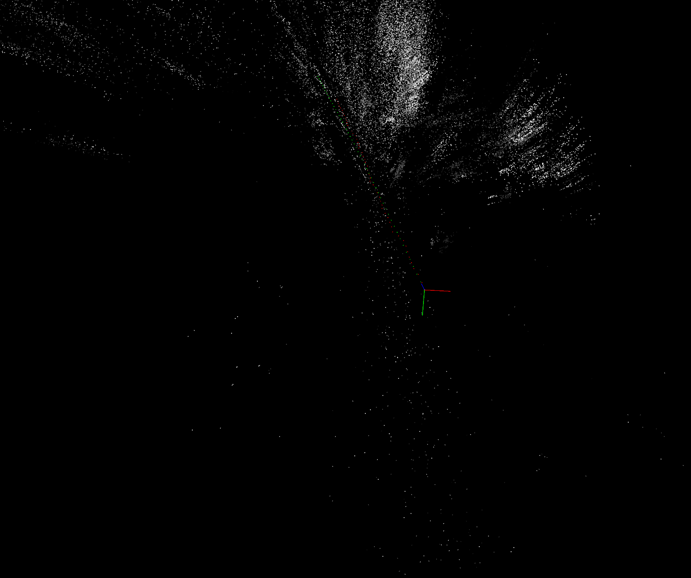

# V-Slam Project

## Introduction

Simultaneous localization and mapping (SLAM) is the computational problem of constructing or updating a map of an unknown environment while simultaneously keeping track of an agent's location within it. While this initially appears to be a chicken-and-egg problem there are several algorithms known for solving it, at least approximately, in tractable time for certain environments.

## Display Results
It is possible to visualize the 3D trajectory with correspondence points.
<p align="center">

</p>


## Dependencies

- Pangolin
- requirements.txt

## Installing Pangolin

Pangolin is a set of lightweight and portable utility libraries for prototyping 3D, numeric or video based programs and algorithms. It is used quite widely in the field of Computer Vision as a means to remove platform-specific boilerplate and make it easy to visualize data.

The offical github is found at: https://github.com/stevenlovegrove/Pangolin

### How to install Pangolin?

1) Clone the github

```
# Clone Pangolin along with it's submodules
git clone --recursive https://github.com/stevenlovegrove/Pangolin.git
```

2) Now download the necessary dependencies

```
# See what package manager and packages are recommended
./scripts/install_prerequisites.sh --dry-run recommended

# Override the package manager choice and install all packages
./scripts/install_prerequisites.sh -m brew al
```

3) Build Pangolin (cpp and python)

```
# Get Pangolin
cd ~/your_fav_code_directory && git clone --recursive https://github.com/stevenlovegrove/Pangolin.git
cd Pangolin 

# Install dependencies (as described above, or your preferred method)
./scripts/install_prerequisites.sh recommended

# Configure and build
mkdir build && cd build
cmake .. && cmake --build .

# Check the output to verify selected python version
cmake --build . -t pypangolin_pip_install
```

### Installation of ROS (not needed yet)
```
sudo sh \
    -c 'echo "deb http://packages.ros.org/ros/ubuntu `lsb_release -sc` main" \
        > /etc/apt/sources.list.d/ros-latest.list'

wget http://packages.ros.org/ros.key -O - | sudo apt-key add -

sudo apt-get install python-catkin-pkg
```

# Usefull links

1) https://github.com/geohot/twitchslam/blob/master/display.py
2) https://github.com/yosoufe/SelfStudyRobotics/blob/a0ba92f82f01d44f5a786c1cc1b701641cc18dd1/experiments/visualizers/test_pangoline.py
3) https://github.com/DroidAITech/vslam-evaluation/blob/931b7cba55a36ebeea31d4ff45d57af244a2fac9/ORB_SLAM2/ORB_SLAM2/src/Viewer.cc
4) https://www.google.dk/search?q=openGl+draw+camera&source=hp&ei=KAIYYvqeH8yMxc8PycmPoAo&iflsig=AHkkrS4AAAAAYhgQOBbVLwdlY2NtFjKxwSV9Ids_qCzH&ved=0ahUKEwj60rq3rZn2AhVMRvEDHcnkA6QQ4dUDCAc&uact=5&oq=openGl+draw+camera&gs_lcp=Cgdnd3Mtd2l6EAMyBggAEBYQHjIGCAAQFhAeOggIABCABBCxAzoLCC4QgAQQxwEQrwE6CwguELEDEIMBENQCOg4ILhCABBCxAxDHARCvAToICAAQsQMQgwE6BggAEAoQQzoECAAQQzoLCAAQgAQQsQMQgwE6BQgAEIAEOg4ILhCABBCxAxDHARDRAzoHCAAQsQMQQzoICAAQFhAKEB5KBQhAEgExUABY2RZgzxdoAHAAeACAAXiIAcUIkgEEMTcuMZgBAKABAQ&sclient=gws-wiz
5) http://www.open3d.org/docs/release/compilation.html
6) https://docs.opencv.org/4.x/d9/d0c/group__calib3d.html#gae850fad056e407befb9e2db04dd9e509